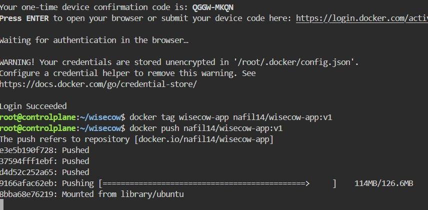
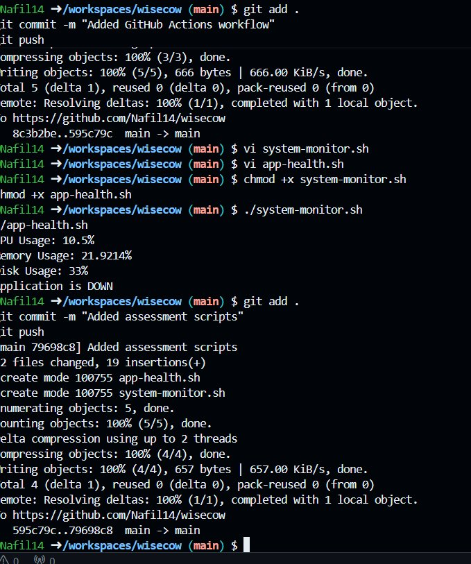
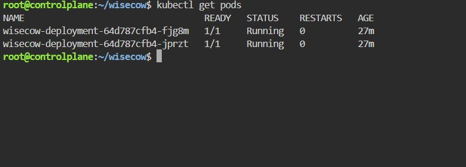
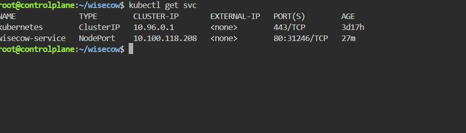
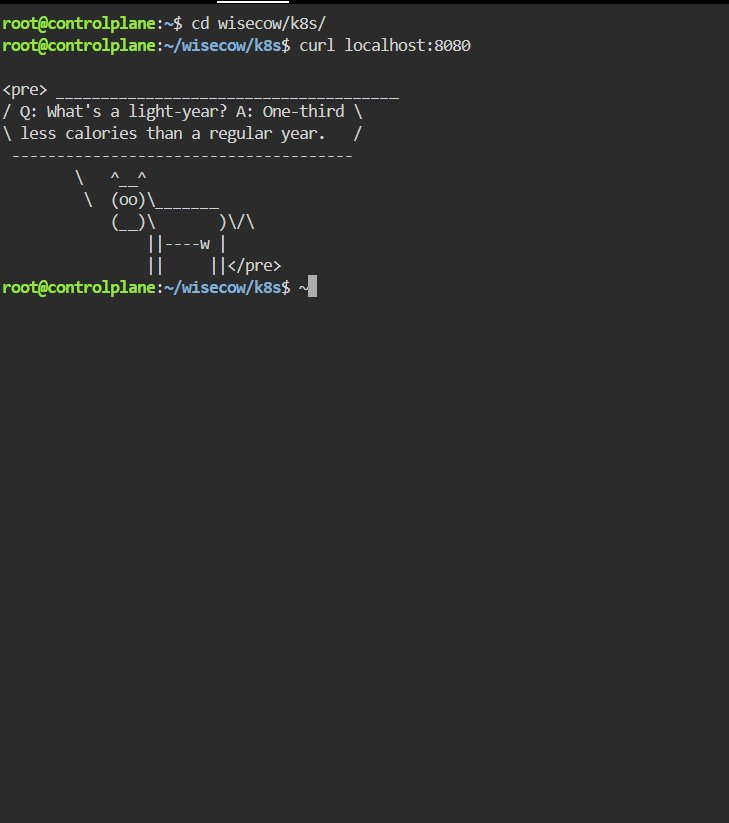
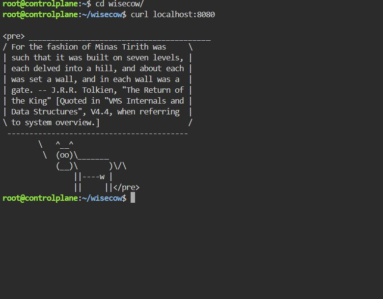
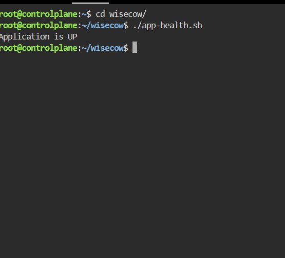
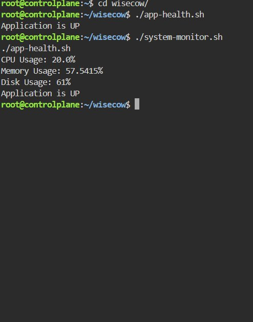
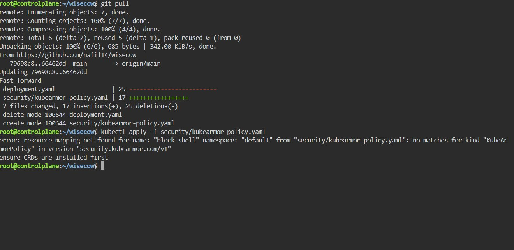

# 🐄 Wisecow — Kubernetes Deployment

Containerization and deployment of the **Wisecow** application on Kubernetes with CI/CD automation, health monitoring scripts, and zero-trust security policy.

**GitHub:** [github.com/Nafil14](https://github.com/Nafil14)  
**DockerHub:** `nafil14/wisecow-app`

---

## Technologies Used

| Category | Tool |
|---|---|
| Containerization | Docker |
| Orchestration | Kubernetes |
| CI/CD | GitHub Actions |
| Scripting | Bash |
| Registry | DockerHub |
| Security | KubeArmor |

---

## Project Structure

```
.
├── .github/workflows/
│   └── docker-build.yml        # CI/CD pipeline
├── k8s/
│   ├── deployment.yaml         # Kubernetes Deployment
│   └── service.yaml            # NodePort Service
├── security/
│   └── kubearmor-policy.yaml   # Zero-trust security policy
├── screenshots/                # Project screenshots
├── Dockerfile                  # Container image definition
├── wisecow.sh                  # Main application script
├── app-health.sh               # Application health checker
├── system-monitor.sh           # System metrics monitor
└── README.md
```

---

## Dockerization

Build, tag, and push the image to DockerHub:

```bash
docker build -t nafil14/wisecow-app:v1 .
docker tag wisecow-app nafil14/wisecow-app:v1
docker push nafil14/wisecow-app:v1
```



---

## CI/CD Pipeline

GitHub Actions workflow (`.github/workflows/docker-build.yml`) automates Docker image build and push to DockerHub on every commit to `main`.



---

## Kubernetes Deployment

Apply the deployment and service manifests:

```bash
kubectl apply -f k8s/deployment.yaml
kubectl apply -f k8s/service.yaml
```

### Check Pods

```bash
kubectl get pods
```



### Check Services

```bash
kubectl get svc
```



### Access the Application

```bash
kubectl port-forward service/wisecow-service 8080:80
curl localhost:8080
```





---

## Monitoring Scripts

### Application Health Checker

```bash
./app-health.sh
```

Performs an HTTP health check and prints `Application is UP` or `Application is DOWN`.



### System Health Monitor

```bash
./system-monitor.sh
```

Reports CPU usage, memory usage, disk usage, and application availability.



---

## KubeArmor Zero-Trust Security Policy

A KubeArmor policy (`security/kubearmor-policy.yaml`) enforces zero-trust security inside the container:

- Blocks shell execution (`/bin/sh`, `/bin/bash`)
- Targets pods via label selector: `app: wisecow`
- Policy name: `block-shell`
- API version: `security.kubearmor.com/v1`

```bash
kubectl apply -f security/kubearmor-policy.yaml
```



> **Note:** The playground environment does not have KubeArmor CRDs pre-installed, so live policy enforcement could not be demonstrated. The policy YAML is included for production cluster use.

---

## Architecture Flow

```
GitHub Repository
        │
        ▼
GitHub Actions CI/CD
        │  (build + push on every commit to main)
        ▼
DockerHub — nafil14/wisecow-app:v1
        │
        ▼
Kubernetes Deployment (2 replicas)
        │
        ▼
NodePort Service (port 80:31246)
        │
        ▼
Wisecow App (random quotes via cowsay)
```

---

## Author

**Nafil A**  
GitHub: [github.com/Nafil14](https://github.com/Nafil14)
